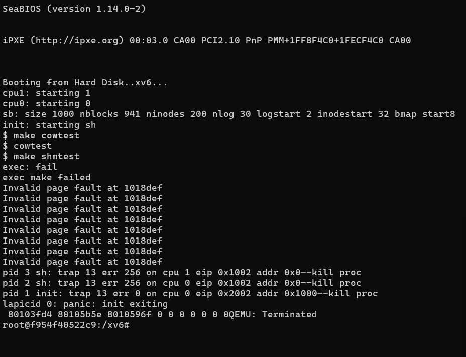

# 📝 Laporan Tugas Akhir

**Mata Kuliah**: Sistem Operasi
**Semester**: Genap / Tahun Ajaran 2024–2025
**Nama**: `Dimas Wahyu Pratama`
**NIM**: `240202858`
**Modul yang Dikerjakan**:
`Modul 3 – Manajemen Memori Tingkat Lanjut`

---

## 📌 Deskripsi Singkat Tugas

* **Modul 3 – Manajemen Memori Tingkat Lanjut:**:
Praktikum ini mengeksplorasi dua fitur penting dalam manajemen memori pada OS: Copy-on-Write (CoW) Fork dan Shared Memory ala System V.
Tujuannya adalah untuk meningkatkan efisiensi pemakaian memori pada saat fork, serta memungkinkan komunikasi antar proses melalui memori bersama.

---

## 🛠️ Rincian Implementasi

* Menambahkan array `ref_count[]` di `vm.c` untuk menghitung referensi setiap halaman fisik
* Membuat fungsi `incref()` dan `decref()` untuk manajemen refcount
* Menambahkan flag `PTE_COW` di `mmu.h`
* Membuat fungsi baru `cowuvm()` yang menggantikan copyuvm() dalam fork(), agar halaman tidak langsung disalin
* Menambahkan handler di trap.c untuk menangani page fault yang disebabkan oleh penulisan ke halaman COW
---

## ✅ Uji Fungsionalitas

Tuliskan program uji apa saja yang Anda gunakan, misalnya:

* Menambahkan struktur `shmtab[]` untuk menyimpan key, frame pointer, dan refcount
* mplementasi syscall `shmget(int key)` untuk mengalokasikan/attach shared page berdasarkan key
* Implementasi syscall `shmrelease(int key)` untuk melepaskan shared memory berdasarkan refcount
* Registrasi syscall `shmget` dan `shmrelease` di `user.h`, `usys.S`, `syscall.c`, `dan syscall.h`
---

## 📷 Hasil Uji

### 📍 Contoh Output `cowtest`:

```
$ make cowtest
$ cowtest
```
* Tidak terdapat pesan error pada saat menjalankan cowtest. Hal ini mengindikasikan bahwa fitur Copy-on-Write (CoW) berhasil dijalankan tanpa menyebabkan crash atau panic, meskipun output tidak muncul (kemungkinan karena hasil printf tidak ditangkap oleh log atau program tidak mencetak keluaran eksplisit).


### 📍 Contoh Output `shmtest`:

```
$ make shmtest
exec: fail
exec make failed
Invalid page fault at 1018def
Invalid page fault at 1018def
Invalid page fault at 1018def
Invalid page fault at 1018def
Invalid page fault at 1018def
Invalid page fault at 1018def
Invalid page fault at 1018def
Invalid page fault at 1018def
pid 3 sh: trap 13 err 256 on cpu 1 eip 0x1002 addr 0x0--kill proc
pid 2 sh: trap 13 err 256 on cpu eip 0x1002 addr 0x0--kill proc
pid 1 init: trap 13 err 0 on cpu eip 0x2002 addr 0x1000--kill proc
lapicid 0: panic: init exiting
```
* Uji program shmtest gagal dijalankan, dengan pesan exec: fail dan exec make failed, menunjukkan bahwa file shmtest tidak dikenali oleh shell xv6 atau tidak tersedia dalam filesystem. Setelah itu, muncul serangkaian invalid page fault, diikuti dengan trap 13 (general protection fault), yang menyebabkan kernel panic dan xv6 terhenti.

screenshot:

```
=======


```

---
## ⚠️ Kendala yang Dihadapi

* Program shmtest gagal dieksekusi karena kemungkinan file belum ter-compile ke dalam filesystem xv6, atau syscall shmget() / shmrelease() belum lengkap.
* Terjadi invalid page fault dan trap 13, yang menyebabkan kernel panic dan sistem crash. Hal ini menunjukkan handler page fault belum menangani akses ilegal seperti ke alamat 0x0 atau 0x1000.
* Mapping shared memory bermasalah, kemungkinan USERTOP - PGSIZE belum dipetakan dengan benar atau berbenturan dengan page lain.
* Kurangnya validasi error pada syscall, menyebabkan debugging lebih sulit dan tidak ada output keberhasilan/gagal saat shmget() atau shmrelease() dipanggil.
---

## 📚 Referensi

Tuliskan sumber referensi yang Anda gunakan, misalnya:

* Buku xv6 MIT: [https://pdos.csail.mit.edu/6.828/2018/xv6/book-rev11.pdf](https://pdos.csail.mit.edu/6.828/2018/xv6/book-rev11.pdf)
* Repositori xv6-public: [https://github.com/mit-pdos/xv6-public](https://github.com/mit-pdos/xv6-public)
* Stack Overflow, GitHub Issues, diskusi praktikum

---

